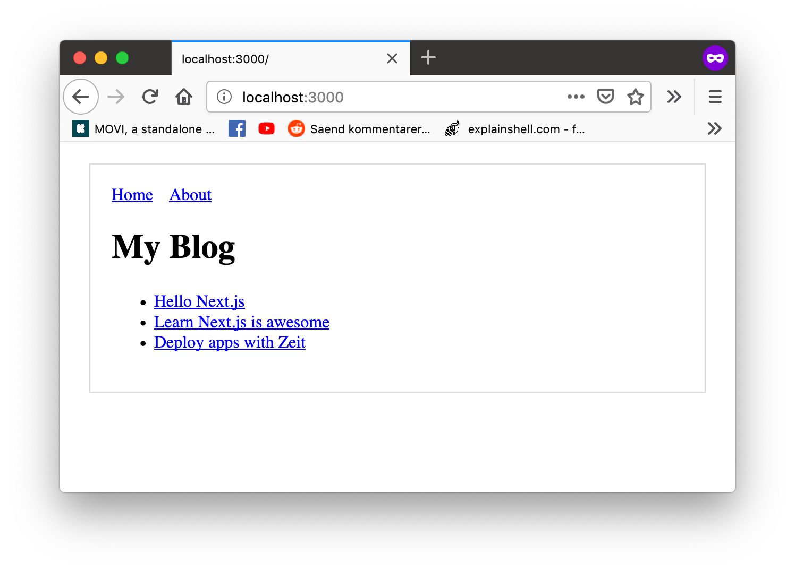

# Simple Next.js Example

## Installation

Download and install Node.js from [this link](https://nodejs.org/en/download/)

When you have Node.js installed run `npm install` to install all dependencies.

## Developing

To view the website on your computer, run `npm run dev` and go to [http://localhost:3000](http://localhost:3000) in the browser. If you change any of the files in `components/` or `pages/` you will automatically see the changes in the browser.

## Building and Exporting

Run `npm run build` to build a static version of the website.
